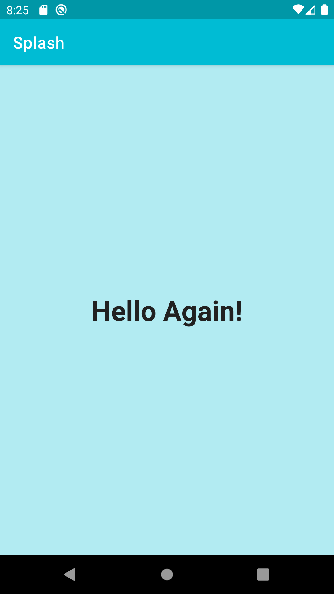

# Ejemplo de Splash Screen en Android

Hola, soy José Humanes Humanes, ingeniero de software independiente. Me dedico al desarrollo de aplicaciones nativas Android, con una arquitectura robusta y escalable que alarga su vida útil y facilita su mantenimiento.

## Descripción

Este código fuente es un ejemplo de implementación moderna de una Splash Screen para una aplicación Android.

La Splash Screen se puede aprovechar para hacer una presentación agradable de la aplicación mientras se realiza el procesamiento inicial necesario para comenzar a trabajar.

